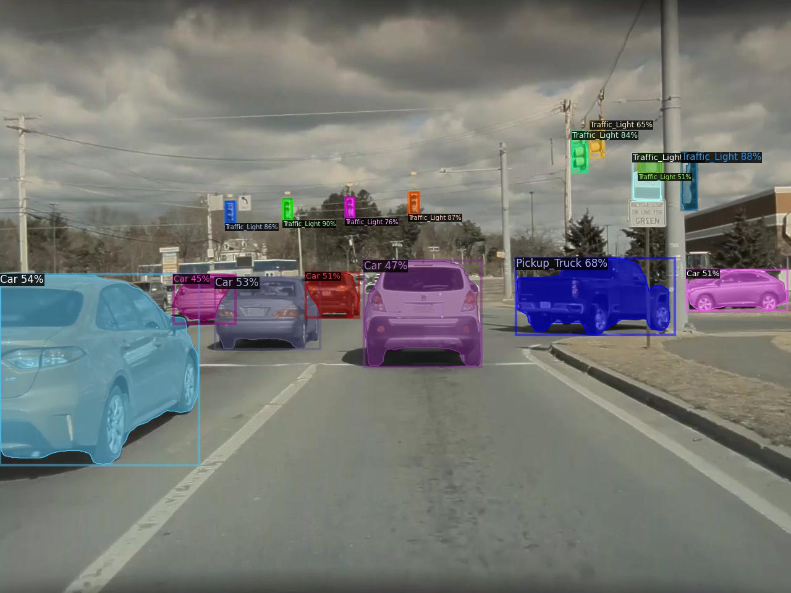
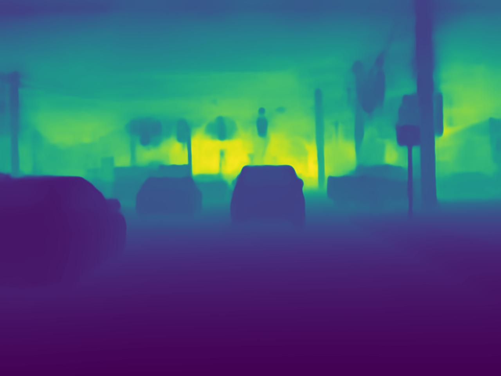
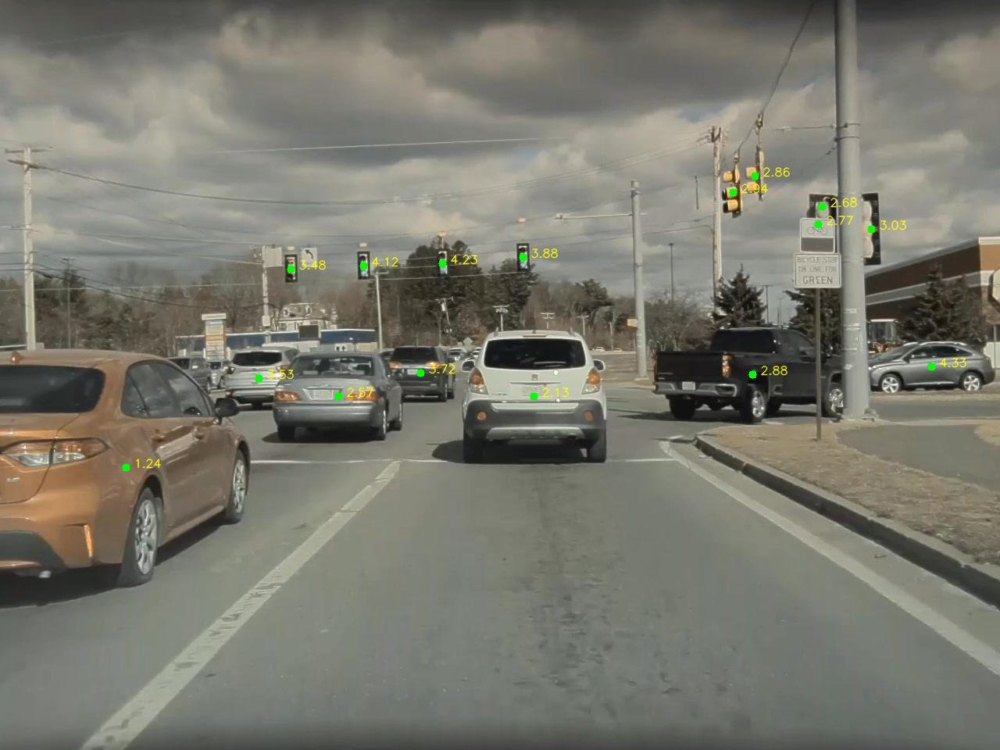
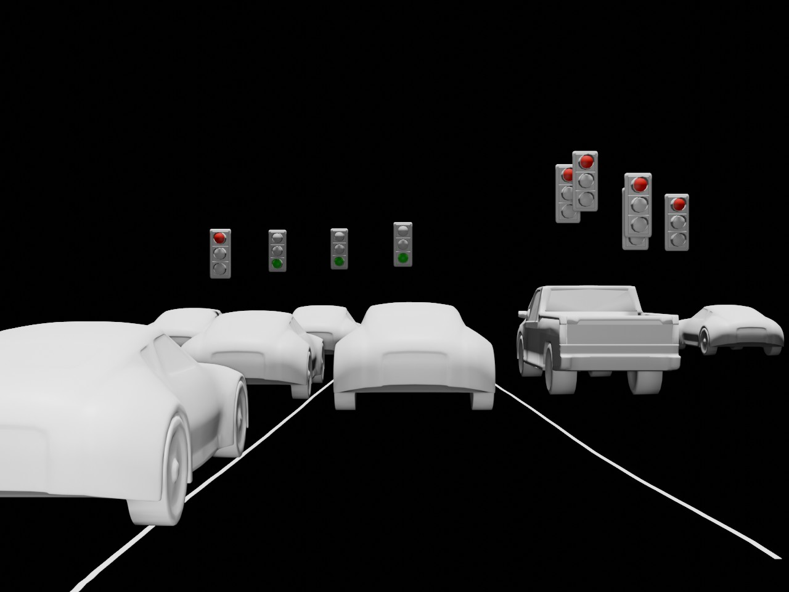

# Einstein Vision - Phase 1 Documentation

## Overview

Einstein Vision Phase 1 outlines a methodology for transforming 2D video frames into a 3D virtual environment. This process involves several key steps, including instance segmentation, depth estimation, and the projection of 2D image coordinates into 3D space. By integrating cutting-edge machine learning models, this project aims to create a dynamic and accurate representation of real-world scenes within a 3D Blender environment.

## Methodology

The workflow begins by analyzing each frame from the front camera video. The first step is to perform instance segmentation on predefined classes within each frame. Once the objects are segmented, we calculate the centroids of their bounding boxes. Following this, we estimate the depth of these centroids. The gathered data, including coordinates and depth information, is then stored in a JSON file. This file serves as a bridge to the Blender environment, where the 2D image coordinates of the centroids are projected into 3D space using the 2D-3D perspective projection equation.

### Instance Segmentation with Detic

For instance segmentation, we utilize Detic, a powerful tool designed for precise object identification and segmentation within images.

- **Detic Repository**: [Visit GitHub](https://github.com/facebookresearch/Detic)

#### Visualizations:

- **Segmentation Mask**: Displays segmented objects with distinct colors for each class.

- **Binary Mask**: Shows a simplified, binary view of the segmented areas, enhancing clarity for processing.

### Lane Detection with CLRNet

Lane detection is achieved through CLRNet, a specialized network for accurate and efficient lane marking detection.

- **CLRNet Repository**: [Visit GitHub](https://github.com/Turoad/CLRNet)

### Depth Estimation with ZoeDepth

Depth estimation is conducted using ZoeDepth, which provides a one-shot metric depth prediction, essential for accurate 3D positioning.

- **ZoeDepth Repository**: [Visit GitHub](https://github.com/isl-org/ZoeDepth)

#### Depth Estimation Visualizations:

- **Depth Map**: Offers a visual representation of the scene's depth, with varying colors indicating different distances.

- **Centroid Depth Estimate**: Combines the depth map with centroid locations, illustrating the depth of each identified object's central point.

### Final Output Visualization

The final stage involves comparing the original video frames with their rendered 3D counterparts, showcasing the transformation achieved through this methodology.

- **Original vs. Rendered Output**: A side-by-side comparison of the original 2D frame and its 3D rendered output in the Blender environment.

## Limitations and Future Work

While the current approach demonstrates significant potential, there are several identified limitations:

- **Lane Categorization**: The current system does not differentiate between various types of lanes (e.g., dotted, red, white). Future iterations will explore networks capable of detailed lane categorization.
  
- **Partial Object Detection**: When an object is only partially detected, the 2D bounding box may inaccurately represent its centroid, leading to incorrect height positioning in the 3D space. Implementing 3D bounding boxes will provide more accurate centroid estimates.
  
- **Object Orientation**: Presently, objects are positioned facing forwards or backwards, ignoring their actual orientation relative to the camera. This limitation will be addressed by incorporating 3D bounding boxes, enabling accurate orientation representation.

This documentation outlines the innovative approach and methodology behind Einstein Vision Phase 1, highlighting both its capabilities and areas for future improvement.
 
